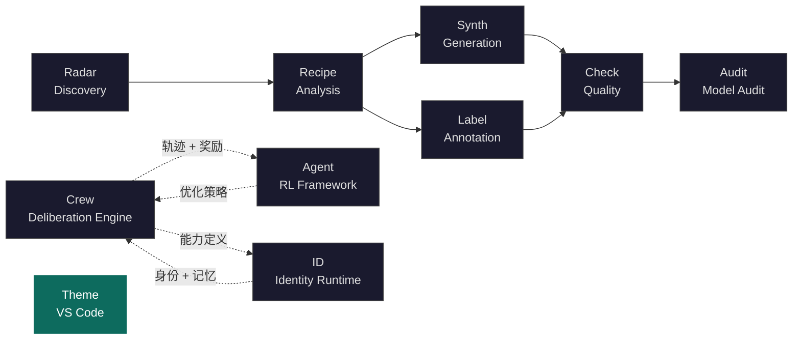

<div align="center">

<h1>knowlyr-theme</h1>

<h3>Pro-human Color Theme for VS Code</h3>

<p><strong>温暖语法 · 干净美学 · 品牌青绿 — 为专注阅读而设计的 VS Code 主题</strong><br/>
<em>Warm syntax, clean aesthetic, brand teal — a VS Code theme designed for focused reading</em></p>

[](https://code.visualstudio.com/)
[](LICENSE)
[-teal.svg)](#themes)

[Themes](#themes) · [Color Palette](#color-palette) · [Terminal](#terminal) · [Install](#install) · [Ecosystem](#ecosystem)

</div>

---

## Themes

**Knowlyr Dark** — 深色背景带青绿色调（`#151c1a`），适合长时间编码。

**Knowlyr Light** — 浅色背景带青绿暖白（`#f0f5f3`），适合白天使用。

两套主题共享同一套语法色板，支持 `window.autoDetectColorScheme` 跟随系统明暗自动切换。

---

## Design Principles

| 原则 | 说明 |
|:---|:---|
| **品牌一致** | 主色 Teal 取自 [knowlyr.com](https://knowlyr.com) CSS `--accent`，光标、选区、高亮全系贯穿 |
| **色温统一** | 所有 UI 表面带微量 Teal 色调——没有纯灰，从编辑器到终端到 Notebook 一气呵成 |
| **对比度优先** | 语法色全部通过 WCAG AA（4.5:1），注释和行号单独调过，久看不累 |
| **终端友好** | 16 色 ANSI 重新分配：Cyan = 品牌色，Green = 翡翠绿（同色温），不侵入功能色（红/蓝/黄不动） |
| **Diff 舒适** | 插入/删除背景低透明度，不遮挡代码阅读 |

---

## Color Palette

### Brand

| | Light | Dark |
|:---|:---|:---|
| **Teal** (Primary) | `#0d6b5e` | `#2eaa8e` |
| Editor Background | `#f0f5f3` | `#151c1a` |
| Selection | `#c2e6e0` | `#1e3530` |
| Cursor | `#0d6b5e` | `#2eaa8e` |

### Syntax

| Role | Light | Dark |
|:---|:---|:---|
| Functions | `#3574e0` | `#56a8f5` |
| Strings | `#3d7a30` | `#6aab73` |
| Keywords | `#b35c2a` | `#cf8e6d` |
| Types / Classes | `#a04da0` | `#c77dbb` |
| Numbers | `#1a8893` | `#2aacb8` |
| Decorators | `#9e7c10` | `#c9a836` |
| Comments | `#6f737a` | `#7a7e85` |

---

## Terminal

ANSI 16 色经过品牌色重分配：

| Color | Light | Dark | Design Note |
|:---|:---|:---|:---|
| Cyan | `#0d6b5e` | `#2eaa8e` | = Brand Teal |
| BrightCyan | `#2eaa8e` | `#50d4b8` | Teal lighter variant |
| Green | `#268840` | `#38b756` | Emerald (same warmth as Teal) |
| BrightGreen | `#38b756` | `#55d872` | |
| Magenta | `#964098` | `#b882c0` | Blue-purple (complements Teal) |
| BrightMagenta | `#b882c0` | `#d0a4d6` | |
| Red / Blue / Yellow | unchanged | unchanged | Functional colors untouched |

终端光标、命令装饰器、搜索高亮均对齐品牌色。

---

## Install

### From Source (Manual)

```bash
# Clone
git clone https://github.com/liuxiaotong/knowlyr-theme.git

# Copy to VS Code extensions
cp -r knowlyr-theme ~/.vscode/extensions/knowlyr-theme

# Restart VS Code, then:
# Cmd+K Cmd+T → select "Knowlyr Dark" or "Knowlyr Light"
```

### Auto Dark/Light Switching

在 VS Code `settings.json` 中添加：

```json
{
  "window.autoDetectColorScheme": true,
  "workbench.preferredDarkColorTheme": "Knowlyr Dark",
  "workbench.preferredLightColorTheme": "Knowlyr Light"
}
```

系统切换明暗模式时，主题自动跟随。

---

## Ecosystem

<details>
<summary>Architecture Diagram</summary>



</details>

| Layer | Project | Description | Repo |
|:---|:---|:---|:---|
| Discovery | **AI Dataset Radar** | 数据集竞争情报、趋势分析 | [GitHub](https://github.com/liuxiaotong/ai-dataset-radar) |
| Analysis | **DataRecipe** | 逆向分析、Schema 提取、成本估算 | [GitHub](https://github.com/liuxiaotong/data-recipe) |
| Production | **DataSynth** / **DataLabel** | LLM 批量合成 / 轻量标注 | [GitHub](https://github.com/liuxiaotong/data-synth) · [GitHub](https://github.com/liuxiaotong/data-label) |
| Quality | **DataCheck** | 规则验证、重复检测、分布分析 | [GitHub](https://github.com/liuxiaotong/data-check) |
| Audit | **ModelAudit** | 蒸馏检测、模型指纹 | [GitHub](https://github.com/liuxiaotong/model-audit) |
| Identity | **knowlyr-id** | 身份系统 + AI 员工运行时 | [GitHub](https://github.com/liuxiaotong/knowlyr-id) |
| Deliberation | **Crew** | 对抗式多智能体协商 · 持久记忆进化 · MCP 原生 | [GitHub](https://github.com/liuxiaotong/knowlyr-crew) |
| Agent Training | **knowlyr-gym** | Gymnasium 风格 RL 框架 · 过程奖励模型 · SFT/DPO/GRPO | [GitHub](https://github.com/liuxiaotong/knowlyr-gym) |
| Developer Tools | **Knowlyr Theme** | VS Code 品牌主题 — 温暖语法 · 品牌青绿 | You are here |

---

## License

[MIT](LICENSE)

---

<div align="center">
<sub><a href="https://knowlyr.com">knowlyr</a> — pro-human color theme for VS Code</sub>
</div>
